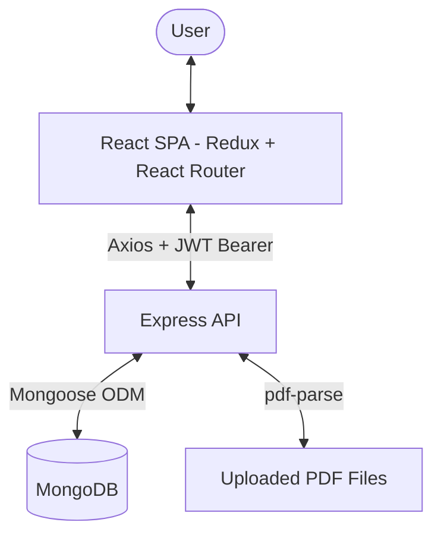

# QuizzApp – MERN PDF-to-Quiz Generator

[](https://reactjs.org/)
[](https://nodejs.org/)
[](https://expressjs.com/)
[](https://www.mongodb.com/)
[](https://redux.js.org/)
[](https://jwt.io/)

QuizzApp is a full-stack MERN application that turns any uploaded **PDF book/document into a multiple-choice quiz automatically**, and also supports manually-created topic-wise quizzes. Users can register/login, upload a PDF, have the text extracted page-by-page, generate MCQs from that content, take the quiz, and track their results.

---

## 🚀 Key Features

### 1. PDF Upload & Text Extraction
* Upload a PDF ("Book"); the backend parses it page-by-page using `pdf-parse`, preserving physical page numbers.
* Extracted pages are stored in MongoDB so they can be reused without re-parsing the file.
* A minimum readable-text threshold is enforced — if a PDF has no extractable text (e.g. a pure scan), the upload is rejected with a clear message.

### 2. Automatic MCQ Generation
* Multiple-choice questions are generated **algorithmically** from the extracted text (sentence splitting, keyword/token analysis, and difficulty scoring) — no external AI API is called for this.
* Supports a configurable question `limit` (5–50) and `difficulty` (`easy` / `medium` / `hard`).
* Each generated question is linked back to the page number(s) it was derived from.

### 3. Manual / Topic Quizzes
* Alongside auto-generated book quizzes, an **admin flow** (`/admin`) allows creating standalone topic quizzes with custom questions and options, stored separately from book-derived questions.
* Users can browse and take these topic quizzes (`TopicQuiz`, `QuizPlayer` components) independent of any uploaded book.

### 4. Authentication
* JWT-based registration/login with bcrypt password hashing.
* Protected routes on both the book/question endpoints (via middleware) and the frontend (`ProtectedRoute`).

### 5. Results Tracking
* Quiz attempts (quiz ID + result) are appended to the user's profile in MongoDB, so history persists across sessions.
* Dedicated pages to review results and see the correct answers for every question (`Resultshow`, `ShowAllAnswers`).

### 6. Book & Question Management
* List, view pages of, and delete uploaded books (deleting a book cascades to remove its pages and generated questions, plus the file on disk).

---

## 🛠️ Architecture



* **Frontend:** Create React App, React Router v6, Redux + Redux Thunk for state, Tailwind CSS, react-toastify for notifications.
* **Backend:** Express + Mongoose, JWT auth, Multer for file uploads, `pdf-parse` for text extraction.

---

## 📊 Data Model (MongoDB / Mongoose)

| Model | Purpose |
| :--- | :--- |
| `User` | Name, email, hashed password, and an array of quiz attempts (`quizId` + `quizResult`) |
| `Book` | Metadata for an uploaded PDF (title, stored file path) |
| `Page` | Extracted text per physical page, linked to a `Book` |
| `Question` | Auto-generated MCQ (question text, options, correct index, difficulty, source page numbers), linked to a `Book` |
| `PostQuiz` | Manually-created/topic quizzes with their own question array, used by the admin quiz flow |

---

## ⚙️ Getting Started

### Prerequisites
* **Node.js** (v16.15.0 as specified in the backend's `engines` field; newer LTS versions should also work)
* **MongoDB** (local instance or Atlas connection string)

### Backend Setup
```bash
cd Backend-MERN_Quiz_APP
npm install
```

Create a `.env` file in `Backend-MERN_Quiz_APP/`:
```env
PORT=5000
DATABASE=mongodb://localhost:27017/quizzapp
JWT_SECRET=your_jwt_secret
```

Run the server:
```bash
npm start
```
The API will be available at `http://localhost:5000`.

### Frontend Setup
```bash
cd Frontend_MERN_Quize_App
npm install
```

Optionally create a `.env` to point at a non-default backend:
```env
REACT_APP_API_BASE=http://localhost:5000
```
(If unset, the app defaults to the deployed backend at `https://quizzapp-backend-abisha.onrender.com` on most pages, and `http://localhost:5000` in the Redux action file — set `REACT_APP_API_BASE` explicitly for consistent local development.)

Run the frontend:
```bash
npm start
```
Open `http://localhost:3000` in your browser.

### Deployment
* The backend includes a `Procfile` (`web: npm run start`), so it's ready for Heroku-style platforms; the live instance referenced by the frontend is hosted on **Render**.
* The frontend is a standard CRA app (`npm run build` outputs to `build/`) and can be deployed to any static host (Vercel, Netlify, Render static sites, etc.).

---

## 📡 API Endpoints

### 🔐 Auth (mounted at `/`)
* `POST /register` - Register a new user
* `POST /login` - Authenticate and receive a JWT

### 📄 Books & Pages (auth required)
* `POST /upload/file` - Upload a PDF, extract text, and save it as a `Book` with its `Page`s
* `GET /books` - List all uploaded books
* `GET /pages/:bookId` - Get extracted pages for a book
* `DELETE /books/:bookId` / `POST /books/:bookId/delete` - Delete a book and cascade-delete its pages, questions, and file

### ❓ Question Generation (auth required)
* `POST /generate-questions/:bookId` - Generate MCQs from a book's extracted text (`body: { limit, difficulty }`)
* `GET /questions/:bookId` - Fetch previously generated questions for a book

### 🗂️ Topic Quizzes
* `POST /admin` - Create a new topic quiz (`body: { title, questionArray }`)
* `GET /admin/:value` - Fetch a topic quiz by title
* `GET /quiz` - List all topic quizzes

### 🏆 User Results
* `POST /userResult/:id` / `POST /user/:id` - Append a quiz attempt (`quizId`, `quizResult`) to a user's profile

---

## 📂 Project Structure

```
QuizzApp-MERN--Generator/
├── Backend-MERN_Quiz_APP/
│   ├── src/
│   │   ├── configs/db.js               # MongoDB connection
│   │   ├── controller/                 # auth, quizAdd, displayQuiz, userData
│   │   ├── middleware/auth.middleware.js
│   │   ├── model/                      # Book, Page, Question, User, PostQuiz
│   │   ├── utils/
│   │   │   ├── extractText.js          # PDF text extraction (pdf-parse)
│   │   │   └── mcqgenerator.js         # Rule-based MCQ generation
│   │   ├── upload.js                   # Multer config
│   │   └── index.js                    # Express app & routes
│   └── Procfile
└── Frontend_MERN_Quize_App/
    ├── src/
    │   ├── Components/                 # Admin, Auth, Navbar, Footer, Profile, QuizNew, QuizPlayer, TopicQuiz
    │   ├── Pages/                       # BookList, Home, NewQuizPage, PagesView, Questions, QuizHome, Resultshow, ShowAllAnswers, UploadBook
    │   ├── Redux/                       # actions, reducer, store
    │   ├── Routes/ProtectedRoute.jsx
    │   └── App.jsx
    └── tailwind.config.js
```

